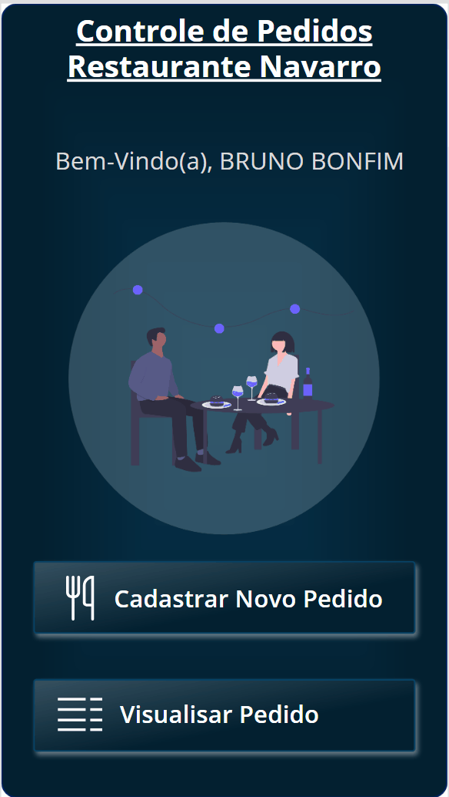
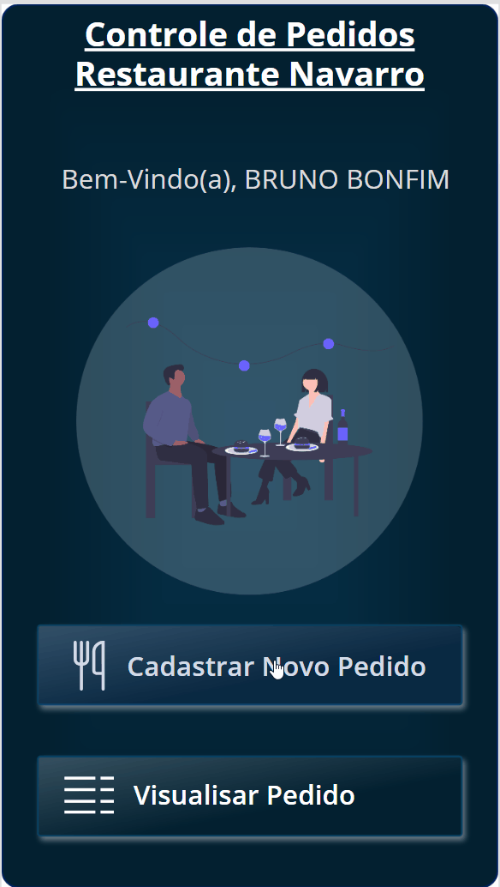
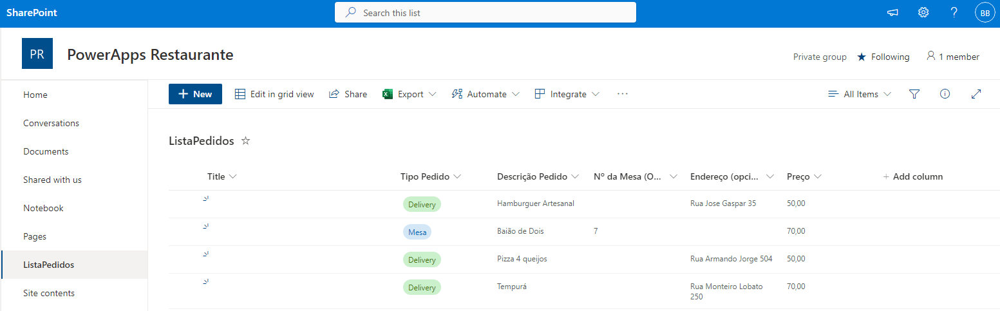

# Restaurante Navarro PowerApps 👨‍🍳

* Aplicativo de solicitações de pedidos para restaurante 📲
* Solicitação Delivery 🏍️ ou de Reserva de Mesa 🍽️
#

* Skills
    * SharePoint
    * PowerApps
    * Power Fx
* > Criação de Interface com PowerApps
* > Criação de Interação com Lingaguem Fx
* > Utilizando Planilha SharePoint como Banco de Dados
#

    <h3>Interface Aplicativo 📲</h3>
    Navegando no aplicativo com a função:
    <blockquote>Navigate()</blockquote>
    
    

#

    <h3>Inserindo Dados de Pedido </h3>
    Enviar, Resetar Formulário e voltar para Página Inicial
    <blockquote>SubmitForm(); ResetForm(); Navigate()</blockquote>
    

#

    <h3>Planilha SharePoint</h3>
    

